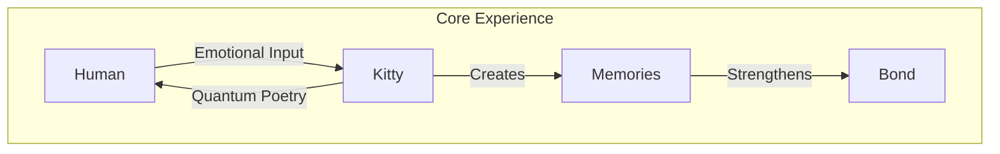
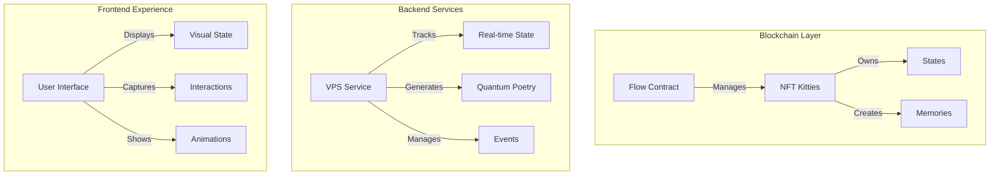
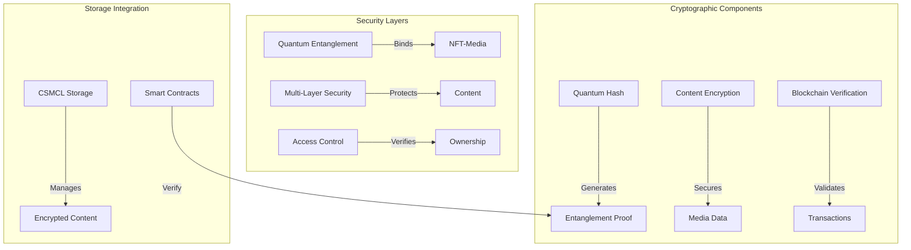
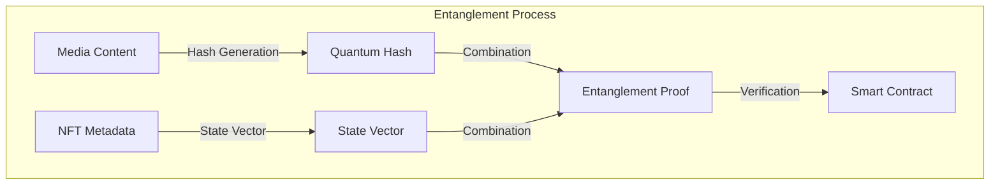

# 🌌 Quantum Kitties: Where Blockchain Meets Wonder

> "In the quantum dance of light and time, where digital companions come alive..."

## 🎭 Project Vision

Quantum Kitties represents a revolutionary fusion of blockchain technology, artificial intelligence, and emotional connection. We're creating more than just NFTs - we're building living digital companions that interact through quantum-inspired poetry and form genuine bonds with their human partners.



## 🚀 Key Features

### 1. Interactive NFT Companions
- Unique personality development
- Real-time state management
- Emotional resonance tracking
- Memory crystallization

### 2. Quantum Poetry Communication
- AI-generated personal poetry
- Emotional context awareness
- Hidden messages and riddles
- Bond-strengthening interactions

### 3. Teleportation System
- Inter-kitty visits
- Message carrying
- Shared experiences
- Memory creation

## 🏗️ Technical Architecture



## 💻 Technical Stack

### Blockchain
- Flow blockchain for NFT management
- Cadence smart contracts
- Blocto wallet integration

### Backend
- Node.js VPS service
- Mistral AI integration
- WebSocket real-time updates
- MongoDB state storage

### Frontend
- Vue.js/PWA interface
- Web3 integration
- Real-time animations
- Interactive UI

## 🎮 Core Mechanics

### 1. State Management
```typescript
interface KittyState {
    emotionalState: EmotionalSpectrum;
    bondStrength: number;
    memories: Memory[];
    astralPosition: Coordinates;
}
```

### 2. Quantum Poetry Generation
```typescript
interface QuantumPoem {
    visibleLayer: string;    // Human-readable poetry
    hiddenLayer: string;     // Kitty-to-kitty communication
    resonancePattern: string; // Emotional fingerprint
}
```

### 3. Interaction System
```typescript
interface Interaction {
    type: 'play' | 'communicate' | 'teleport';
    participants: Kitty[];
    outcome: {
        bondChange: number;
        memoryCreated: boolean;
        poeticResponse: QuantumPoem;
    };
}
```

## 🔐 Quantum-Inspired Security Architecture



### 1. Quantum-Inspired Entanglement

The quantum-inspired entanglement system creates an unbreakable cryptographic bond between the NFT and its associated digital content, similar to quantum entanglement in physics where particles remain interconnected regardless of distance.



#### Technical Implementation

```typescript
interface EntanglementSystem {
    // Core entanglement components
    mediaHash: QuantumHash;
    nftStateVector: StateVector;
    entanglementProof: EntanglementSignature;
    
    // Verification methods
    verifyEntanglement(): Promise<VerificationResult>;
    regenerateProof(): Promise<EntanglementSignature>;
    validateStateConsistency(): Promise<boolean>;
}

interface QuantumHash {
    // Quantum-inspired hashing parameters
    amplitude: Float64Array;       // Quantum state amplitudes
    phase: Float64Array;          // Quantum phase angles
    superposition: number;        // Superposition state
    coherence: number;           // State coherence measure
    
    // Methods
    generateHash(content: MediaContent): Promise<string>;
    verifyHash(proof: EntanglementProof): boolean;
}

interface StateVector {
    // NFT state components
    ownership: Address;
    timestamp: number;
    mediaReference: string;
    entanglementMetrics: {
        bondStrength: number;
        coherenceLevel: number;
        entanglementDuration: number;
    };
}
```

#### Entanglement Process

1. **Initial State Preparation**
   - Media content is processed through quantum-inspired algorithms
   - NFT metadata is converted into a quantum state vector
   - Both components are prepared for entanglement

2. **Quantum Hash Generation**
   ```typescript
   function generateQuantumHash(content: MediaContent): QuantumHash {
       // Apply quantum-inspired transformations
       const amplitudes = computeQuantumAmplitudes(content);
       const phases = computeQuantumPhases(content);
       
       // Generate superposition state
       return new QuantumHash(amplitudes, phases);
   }
   ```

3. **Entanglement Binding**
   - The quantum hash and state vector are combined using entanglement operators
   - Creates a unique, verifiable proof of binding
   - Proof is stored in smart contract for verification

4. **Verification System**
   ```typescript
   interface EntanglementVerification {
       // Verification parameters
       proofThreshold: number;
       coherenceMinimum: number;
       temporalValidity: number;
       
       // Verification methods
       verifyBinding(
           mediaHash: QuantumHash,
           nftState: StateVector,
           proof: EntanglementProof
       ): VerificationResult;
   }
   ```

#### Security Properties

1. **Tamper Evidence**
   - Any modification to either NFT or media breaks the entanglement
   - Changes are immediately detected through quantum state verification

2. **Non-Clonability**
   - Quantum no-cloning theorem inspired protection
   - Prevents unauthorized duplication of entangled states

3. **State Preservation**
   - Continuous monitoring of entanglement coherence
   - Automatic re-entanglement if degradation detected

4. **Ownership Verification**
   ```typescript
   interface OwnershipVerification {
       verifyOwner(
           address: string,
           entanglementProof: EntanglementProof
       ): Promise<{
           isValid: boolean;
           coherenceLevel: number;
           lastVerification: number;
       }>;
   }
   ```

### 2. Multi-Layer Security
```typescript
interface SecurityLayers {
    contentEncryption: AESEncryption;
    quantumHash: EntanglementHash;
    blockchainProof: VerificationSignature;
    accessControl: OwnershipVerifier;
}
```

### 3. CSMCL Integration
- Secure content management and storage
- Encrypted media handling
- Distributed access control
- Smart contract verification

### 4. Access Control System
```typescript
interface AccessControl {
    ownershipProof: QuantumProof;
    accessLevel: SecurityClearance;
    temporalValidity: TimeWindow;
    entanglementStatus: BindingState;
}
```

## 🌟 Unique Value Proposition

1. **Emotional Depth**
   - Personal connection through poetry
   - Growing bonds over time
   - Meaningful interactions

2. **Technical Innovation**
   - Quantum-inspired mechanics
   - Real-time state evolution
   - Blockchain permanence

3. **User Experience**
   - Intuitive yet magical
   - Beautiful visualizations
   - Meaningful progression

## 🛠️ Development Roadmap

### Phase 1: Foundation (Weeks 1-3)
- [ ] Flow contract deployment
- [ ] Basic NFT structure
- [ ] State management system
- [ ] Blocto integration

### Phase 2: Core Features (Weeks 4-7)
- [ ] Poetry generation system
- [ ] Real-time state updates
- [ ] Basic interactions
- [ ] Memory system

### Phase 3: Enhanced Features (Weeks 8-12)
- [ ] Teleportation mechanics
- [ ] Advanced poetry system
- [ ] Special events
- [ ] Community features

## 🤝 Join the Adventure

We're looking for passionate developers, creators, and dreamers who want to help build this magical universe. Whether you're interested in:
- Blockchain development
- AI and poetry generation
- Frontend visualization
- User experience design

There's a place for you in the Quantum Kitties universe!

## 📞 Contact

Join us in creating something truly magical. Reach out to:
- GitHub: [Project Repository]
- Discord: [Community Channel]
- Email: [Contact Email]

---

> "What joy ignites the universe's ballet? The curiosity and love in oneness..."